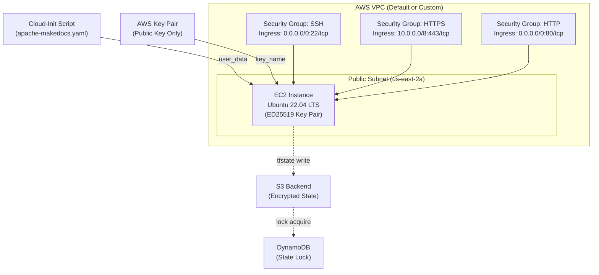

# Terraform AWS Secure Infrastructure Platform

[](https://developer.hashicorp.com/terraform)
[](https://registry.terraform.io/providers/hashicorp/aws/latest)
[](https://github.com/features/actions)
[](https://github.com/aquasecurity/tfsec)
[](https://www.checkov.io/)
[](https://www.infracost.io/)
[](LICENSE)

> **Enterprise-grade Infrastructure-as-Code for regulated AWS environments.** This module provisions hardened, production-ready compute, network security, and key management resources on AWS using security-first Terraform patterns. Designed for teams operating under SOC 2 Type II, CIS AWS Foundations Benchmark, and HIPAA-adjacent workload requirements.

---

## Table of Contents

- [Architecture Overview](#architecture-overview)
- [Security and Compliance Posture](#security-and-compliance-posture)
- [Repository Structure](#repository-structure)
- [Prerequisites](#prerequisites)
- [Remote Backend Configuration](#remote-backend-configuration)
- [Provider and Version Constraints](#provider-and-version-constraints)
- [Input Variables Reference](#input-variables-reference)
- [Outputs Reference](#outputs-reference)
- [CI/CD Pipeline Integration](#cicd-pipeline-integration)
- [Module Usage Example](#module-usage-example)
- [Runbook — Deployment](#runbook--deployment)
- [Runbook — Destruction and Blast Radius](#runbook--destruction-and-blast-radius)
- [Drift Detection and Remediation](#drift-detection-and-remediation)
- [Secret Management](#secret-management)
- [Troubleshooting](#troubleshooting)
- [Contributing and Branch Strategy](#contributing-and-branch-strategy)
- [License and Compliance Notice](#license-and-compliance-notice)

---

## Architecture Overview

This platform provisions a hardened AWS compute environment composed of the following components:

- **EC2 Compute Instance** — Ubuntu 22.04 LTS, bootstrapped via cloud-init to a known-good configuration state. Instance type is parameterized and defaults to a cost-controlled tier enforced by policy.
- **Key Pair Management** — ED25519 SSH key pair injected at provision time. The private key never enters Terraform state; only the public key material is registered with AWS.
- **Security Groups** — Least-privilege ingress rules scoped to specific ports and CIDR ranges. Egress is policy-controlled. Three distinct security groups enforce separation of concerns across SSH administrative access (port 22), encrypted application traffic (port 443/TLS), and plaintext HTTP (port 80).
- **Cloud-Init Bootstrap** — A YAML-formatted cloud-init script provisions OS-level users, injects authorized SSH keys, installs the Apache web server, and deploys a MkDocs-generated static documentation site at first boot without requiring post-provision configuration management.
- **State Management** — Remote backend with S3 object storage, AES-256 server-side encryption, and DynamoDB-backed state locking prevents concurrent apply conflicts.



> **Operational Warning:** The default security group configuration permits inbound SSH from `0.0.0.0/0` for lab interoperability. In production environments, this CIDR **must** be restricted to known bastion host ranges or replaced with AWS Systems Manager Session Manager to eliminate public SSH exposure entirely. Review `var.ssh_allowed_cidrs` before any production apply.

---

## Security and Compliance Posture

| Control | Implementation | CIS AWS Benchmark | SOC 2 CC | PCI-DSS |
|---|---|---|---|---|
| Encrypted state at rest | S3 SSE-AES256 + bucket policy | 2.1.1 | CC6.1 | Req 3.5 |
| State access auditability | S3 server access logging + CloudTrail | 2.6 | CC7.2 | Req 10.2 |
| No plaintext secrets in state | Public key only; private key stays local | 1.21 | CC6.7 | Req 8.2 |
| Least-privilege ingress | Port-scoped security groups | 5.2 | CC6.6 | Req 1.3 |
| SSH key algorithm | ED25519 (no RSA-1024/2048) | 1.22 | CC6.7 | Req 8.3 |
| Immutable OS image | AMI pinned by ID in `versions.tf` | 7.1 | CC7.1 | Req 6.3 |
| Provider plugin integrity | HashiCorp-signed provider with SHA-256 lock | N/A | CC7.1 | Req 6.2 |
| IaC static analysis gate | tfsec + checkov in CI pipeline | N/A | CC8.1 | Req 6.3 |
| Cost guardrail | infracost threshold gate in CI | N/A | CC9.1 | N/A |
| State locking | DynamoDB conditional write | N/A | CC7.3 | Req 6.4 |

> **Compliance Note:** This module does not automatically satisfy any regulatory framework. Controls listed above represent architectural alignments. A qualified auditor must assess applicability to your specific compliance scope.

---

## Repository Structure
```

terraform-aws-secure-platform/ ├── instances/ │ ├── main.tf # Resource declarations: EC2 instance, key pair, security groups │ ├── outputs.tf # Exported values: public DNS, public IP │ ├── provider.tf # AWS provider configuration │ └── versions.tf # Terraform and provider version constraints ├── keys/ │ └── .gitkeep # SSH keys are generated locally; NEVER commit private keys ├── scripts/ │ └── apache-makedocs.yaml # Cloud-init bootstrap: user provisioning, Apache, MkDocs ├── .tfsec/ │ └── config.yml # tfsec custom rule configuration ├── .checkov.yml # Checkov scan policy configuration ├── infracost.yml # Infracost project configuration ├── .github/ │ └── workflows/ │ └── terraform.yml # GitHub Actions CI/CD pipeline ├── .terraform.lock.hcl # Provider dependency lock file (commit this) ├── .gitignore # Excludes: *.tfstate, _.tfstate._, keys/aws_key, .terraform/ ├── CONTRIBUTING.md └── README.md

```

> **Critical:** The `.gitignore` must exclude `keys/aws_key` (private key), `*.tfstate`, `*.tfstate.backup`, and `.terraform/` directories. Committing any of these to version control constitutes a critical security incident. The `.terraform.lock.hcl` file **must** be committed to enforce reproducible provider installations across all engineers and CI environments.

---

## Prerequisites

### Toolchain Requirements

| Tool | Minimum Version | Installation |
|---|---|---|
| Terraform CLI | `>= 1.4.0` | [developer.hashicorp.com](https://developer.hashicorp.com/terraform/install) |
| AWS CLI | `>= 2.13.0` | [aws.amazon.com/cli](https://aws.amazon.com/cli/) |
| tflint | `>= 0.50.0` | [github.com/terraform-linters/tflint](https://github.com/terraform-linters/tflint) |
| tfsec | `>= 1.28.0` | [github.com/aquasecurity/tfsec](https://github.com/aquasecurity/tfsec) |
| checkov | `>= 3.2.0` | `pip install checkov` |
| infracost | `>= 0.10.0` | [infracost.io/docs](https://www.infracost.io/docs/) |
| OpenSSH | `>= 8.9` | OS package manager |

### AWS IAM Permission Boundary

The executing identity (IAM user or role) requires the following minimum permissions. Attach via a scoped IAM policy — do not use `AdministratorAccess` in production pipelines.

```json
{
  "Version": "2012-10-17",
  "Statement": [
    {
      "Effect": "Allow",
      "Action": [
        "ec2:Describe*",
        "ec2:RunInstances",
        "ec2:TerminateInstances",
        "ec2:CreateSecurityGroup",
        "ec2:DeleteSecurityGroup",
        "ec2:AuthorizeSecurityGroupIngress",
        "ec2:AuthorizeSecurityGroupEgress",
        "ec2:RevokeSecurityGroupIngress",
        "ec2:RevokeSecurityGroupEgress",
        "ec2:ImportKeyPair",
        "ec2:DeleteKeyPair",
        "ec2:CreateTags",
        "ec2:DeleteTags"
      ],
      "Resource": "*"
    },
    {
      "Effect": "Allow",
      "Action": [
        "s3:GetObject",
        "s3:PutObject",
        "s3:DeleteObject",
        "s3:ListBucket"
      ],
      "Resource": [
        "arn:aws:s3:::your-tfstate-bucket",
        "arn:aws:s3:::your-tfstate-bucket/*"
      ]
    },
    {
      "Effect": "Allow",
      "Action": [
        "dynamodb:GetItem",
        "dynamodb:PutItem",
        "dynamodb:DeleteItem"
      ],
      "Resource": "arn:aws:dynamodb:us-east-2:ACCOUNT_ID:table/terraform-state-lock"
    }
  ]
}
```

### OIDC Trust Configuration for GitHub Actions

Rather than storing long-lived AWS credentials as GitHub Secrets, configure an IAM OIDC identity provider to grant GitHub Actions federated access.

```bash
# Create the OIDC provider (one-time per AWS account)
aws iam create-open-id-connect-provider \
  --url https://token.actions.githubusercontent.com \
  --client-id-list sts.amazonaws.com \
  --thumbprint-list 6938fd4d98bab03faadb97b34396831e3780aea1

# Attach the scoped IAM role to the OIDC provider
# Trust policy must scope to your specific repository and branch
```

---

## Remote Backend Configuration

> **State Management Warning:** Migrating backend configuration after initial `terraform init` requires `terraform init -migrate-state`. Performing this incorrectly can result in state desynchronization. Always take a manual backup of `terraform.tfstate` before backend migrations. Never store state files in version control.

Create the S3 bucket and DynamoDB table before running `terraform init` in this module. These are typically provisioned by a separate "bootstrap" Terraform workspace.

```hcl
# instances/versions.tf — backend configuration block
terraform {
  backend "s3" {
    bucket         = "your-org-terraform-state-us-east-2"
    key            = "aws-secure-platform/instances/terraform.tfstate"
    region         = "us-east-2"
    encrypt        = true
    kms_key_id     = "arn:aws:kms:us-east-2:ACCOUNT_ID:key/YOUR_KMS_KEY_ID"
    dynamodb_table = "terraform-state-lock"

    # Workspace-aware state isolation
    workspace_key_prefix = "env"
  }
}
```

### Workspace Strategy

| Workspace | S3 State Key Prefix | AWS Account | Purpose |
|---|---|---|---|
| `default` | `env/default/` | Development | Local iteration, non-critical |
| `staging` | `env/staging/` | Non-Production | Pre-production validation |
| `production` | `env/production/` | Production | Live workloads — requires MFA |

```bash
# Select or create a workspace before any plan or apply operation
terraform workspace select staging || terraform workspace new staging
terraform workspace show
```

---

## Provider and Version Constraints

```hcl
# instances/versions.tf
terraform {
  required_version = ">= 1.4.0"

  required_providers {
    aws = {
      source  = "hashicorp/aws"
      version = "~> 5.0"
    }
  }

  backend "s3" {
    # Populated via partial backend config or CI environment variables
    # See: Remote Backend Configuration section above
  }
}
```

```hcl
# instances/provider.tf
provider "aws" {
  region = var.aws_region

  default_tags {
    tags = {
      ManagedBy   = "Terraform"
      Environment = terraform.workspace
      Project     = var.project_name
      Owner       = var.team_owner
      CostCenter  = var.cost_center
    }
  }
}
```

---

## Input Variables Reference

| Name | Type | Default | Required | Description | Sensitive |
|---|---|---|---|---|---|
| `aws_region` | `string` | `"us-east-2"` | No | AWS region for all resource provisioning | No |
| `project_name` | `string` | n/a | **Yes** | Identifier applied to all resource tags and naming conventions | No |
| `team_owner` | `string` | n/a | **Yes** | Owning team name; applied as a tag for cost attribution | No |
| `cost_center` | `string` | n/a | **Yes** | Finance cost center code for chargeback reporting | No |
| `instance_type` | `string` | `"t3.micro"` | No | EC2 instance type; must be within approved instance family policy | No |
| `ami_id` | `string` | n/a | **Yes** | AMI ID for the target OS image; must be region-specific and hardened | No |
| `ssh_public_key_material` | `string` | n/a | **Yes** | ED25519 public key content to register as AWS Key Pair | **Yes** |
| `ssh_allowed_cidrs` | `list(string)` | `["0.0.0.0/0"]` | No | CIDR ranges permitted for inbound SSH (port 22). Restrict to known bastion IPs in production | No |
| `https_allowed_cidrs` | `list(string)` | `["10.0.0.0/8"]` | No | CIDR ranges permitted for inbound HTTPS (port 443) | No |
| `http_allowed_cidrs` | `list(string)` | `["0.0.0.0/0"]` | No | CIDR ranges permitted for inbound HTTP (port 80) | No |
| `cloud_init_script_path` | `string` | `"../scripts/apache-makedocs.yaml"` | No | Relative path from the working directory to the cloud-init YAML file | No |
| `enable_detailed_monitoring` | `bool` | `false` | No | Enables 1-minute CloudWatch metric granularity on the EC2 instance | No |
| `root_volume_size_gb` | `number` | `20` | No | Size of the EC2 root EBS volume in GiB | No |
| `root_volume_encrypted` | `bool` | `true` | No | Enforce EBS volume encryption at rest | No |

---

## Outputs Reference

| Name | Description | Sensitive |
|---|---|---|
| `instance_id` | AWS-assigned EC2 instance ID | No |
| `public_ip` | Public IPv4 address of the provisioned instance | No |
| `public_dns` | Fully qualified public DNS hostname of the instance | No |
| `security_group_ssh_id` | Resource ID of the SSH security group | No |
| `security_group_https_id` | Resource ID of the HTTPS security group | No |
| `security_group_http_id` | Resource ID of the HTTP security group | No |
| `key_pair_name` | Name of the registered AWS Key Pair | No |

---

## CI/CD Pipeline Integration

The following GitHub Actions workflow enforces a plan-on-PR and apply-on-merge gate pattern with OIDC-based AWS authentication. Static analysis gates (`tfsec`, `checkov`, `infracost`) must pass before a plan is generated. The apply step executes only on merge to `main`.

```yaml
# .github/workflows/terraform.yml
name: Terraform CI/CD

on:
  pull_request:
    branches: [main]
    paths:
      - "instances/**"
      - "scripts/**"
  push:
    branches: [main]
    paths:
      - "instances/**"
      - "scripts/**"

permissions:
  id-token: write
  contents: read
  pull-requests: write

env:
  TF_WORKING_DIR: instances
  AWS_REGION: us-east-2
  TF_WORKSPACE: staging

jobs:
  security-scan:
    name: Static Analysis Gates
    runs-on: ubuntu-latest
    steps:
      - uses: actions/checkout@v4

      - name: tfsec Scan
        uses: aquasecurity/tfsec-action@v1.0.3
        with:
          working_directory: ${{ env.TF_WORKING_DIR }}
          soft_fail: false

      - name: checkov Scan
        uses: bridgecrewio/checkov-action@v12
        with:
          directory: ${{ env.TF_WORKING_DIR }}
          framework: terraform
          soft_fail: false
          output_format: github_failed_only

  infracost:
    name: Cost Estimation Gate
    runs-on: ubuntu-latest
    needs: security-scan
    steps:
      - uses: actions/checkout@v4

      - name: Setup Infracost
        uses: infracost/actions/setup@v3
        with:
          api-key: ${{ secrets.INFRACOST_API_KEY }}

      - name: Generate Infracost Estimate
        run: |
          infracost breakdown --path=${{ env.TF_WORKING_DIR }} \
            --format=json \
            --out-file=/tmp/infracost.json

      - name: Post Infracost Comment
        uses: infracost/actions/comment@v3
        with:
          path: /tmp/infracost.json
          behavior: update

  plan:
    name: Terraform Plan
    runs-on: ubuntu-latest
    needs: [security-scan, infracost]
    steps:
      - uses: actions/checkout@v4

      - name: Configure AWS Credentials (OIDC)
        uses: aws-actions/configure-aws-credentials@v4
        with:
          role-to-assume: arn:aws:iam::${{ secrets.AWS_ACCOUNT_ID }}:role/terraform-ci-role
          aws-region: ${{ env.AWS_REGION }}

      - name: Setup Terraform
        uses: hashicorp/setup-terraform@v3
        with:
          terraform_version: "~> 1.4"

      - name: Terraform Init
        working-directory: ${{ env.TF_WORKING_DIR }}
        run: terraform init -input=false

      - name: Terraform Validate
        working-directory: ${{ env.TF_WORKING_DIR }}
        run: terraform validate

      - name: tflint
        uses: terraform-linters/setup-tflint@v4
      - run: |
          tflint --init
          tflint --chdir=${{ env.TF_WORKING_DIR }}

      - name: Terraform Plan
        working-directory: ${{ env.TF_WORKING_DIR }}
        run: |
          terraform workspace select ${{ env.TF_WORKSPACE }} || \
            terraform workspace new ${{ env.TF_WORKSPACE }}
          terraform plan \
            -input=false \
            -var-file="environments/${{ env.TF_WORKSPACE }}.tfvars" \
            -out=tfplan
        env:
          TF_VAR_ssh_public_key_material: ${{ secrets.SSH_PUBLIC_KEY_MATERIAL }}

      - name: Upload Plan Artifact
        uses: actions/upload-artifact@v4
        with:
          name: tfplan
          path: ${{ env.TF_WORKING_DIR }}/tfplan

  apply:
    name: Terraform Apply
    runs-on: ubuntu-latest
    needs: plan
    if: github.ref == 'refs/heads/main' && github.event_name == 'push'
    environment: staging
    steps:
      - uses: actions/checkout@v4

      - name: Configure AWS Credentials (OIDC)
        uses: aws-actions/configure-aws-credentials@v4
        with:
          role-to-assume: arn:aws:iam::${{ secrets.AWS_ACCOUNT_ID }}:role/terraform-ci-role
          aws-region: ${{ env.AWS_REGION }}

      - name: Setup Terraform
        uses: hashicorp/setup-terraform@v3
        with:
          terraform_version: "~> 1.4"

      - name: Download Plan Artifact
        uses: actions/download-artifact@v4
        with:
          name: tfplan
          path: ${{ env.TF_WORKING_DIR }}

      - name: Terraform Init
        working-directory: ${{ env.TF_WORKING_DIR }}
        run: terraform init -input=false

      - name: Terraform Apply
        working-directory: ${{ env.TF_WORKING_DIR }}
        run: |
          terraform workspace select ${{ env.TF_WORKSPACE }}
          terraform apply -input=false -auto-approve tfplan
        env:
          TF_VAR_ssh_public_key_material: ${{ secrets.SSH_PUBLIC_KEY_MATERIAL }}
```

> **Pipeline Security Note:** The `TF_VAR_ssh_public_key_material` value is injected via a GitHub Actions encrypted secret at runtime. It is never written to a `.tfvars` file, committed to source control, or logged to pipeline output. Sensitive variables must follow this pattern for all credentials, tokens, and key material.

---

## Module Usage Example

The following demonstrates consuming this infrastructure as a reusable root module configuration from a parent workspace.

```hcl
# environments/staging/main.tf — Root module consumer

module "secure_compute_platform" {
  source = "../../instances"

  # Required
  project_name             = "platform-core"
  team_owner               = "infrastructure-engineering"
  cost_center              = "CC-1042"
  ami_id                   = "ami-0a0e5d9c7acc336f1" # Ubuntu 22.04 LTS, us-east-2
  ssh_public_key_material  = var.ssh_public_key_material # Injected at runtime; never hardcoded

  # Regional and sizing configuration
  aws_region    = "us-east-2"
  instance_type = "t3.small"

  # Security group CIDR scoping — restrict in production
  ssh_allowed_cidrs   = ["10.64.0.0/16"]  # Corporate VPN egress range only
  https_allowed_cidrs = ["10.0.0.0/8"]
  http_allowed_cidrs  = ["0.0.0.0/0"]

  # Storage hardening
  root_volume_size_gb  = 30
  root_volume_encrypted = true
  enable_detailed_monitoring = true

  # Bootstrap script
  cloud_init_script_path = "../../scripts/apache-makedocs.yaml"
}

output "platform_public_dns" {
  description = "Public DNS endpoint for the provisioned instance"
  value       = module.secure_compute_platform.public_dns
}
```

---

## Runbook — Deployment

Execute the following steps in sequence from the `instances/` working directory. Do not skip steps; each gate serves a functional or compliance purpose.

- [ ] **Step 1 — Generate SSH Key Pair.** Generate the ED25519 key pair locally. The private key remains on the provisioning workstation or within a secrets vault. Never pass it to Terraform.

```bash
ssh-keygen -t ed25519 -f ../keys/aws_key -C "terraform-deploy-$(date +%Y%m%d)"
# Enter a strong passphrase when prompted — this is mandatory, not optional
```

- [ ] **Step 2 — Configure AWS Credentials.** Authenticate to the target AWS account. Prefer short-lived role assumption over static access keys.

```bash
aws configure --profile terraform-deploy
aws sts get-caller-identity --profile terraform-deploy
export AWS_PROFILE=terraform-deploy
```

- [ ] **Step 3 — Initialize the Working Directory.**

```bash
terraform init -upgrade
# Verify: .terraform.lock.hcl is updated; provider checksums are validated
```

- [ ] **Step 4 — Select Target Workspace.**

```bash
terraform workspace select staging || terraform workspace new staging
terraform workspace show
```

- [ ] **Step 5 — Format and Validate.**

```bash
terraform fmt -recursive -check
terraform validate
tflint --init && tflint
tfsec .
checkov -d .
```

- [ ] **Step 6 — Generate and Review Plan.**

```bash
terraform plan \
  -var-file="environments/staging.tfvars" \
  -var="ssh_public_key_material=$(cat ../keys/aws_key.pub)" \
  -out=tfplan.staging

# Review plan output critically before proceeding
# Confirm: resources to add, change, destroy — all expected
```

- [ ] **Step 7 — Apply Infrastructure.**

```bash
terraform apply tfplan.staging
# Confirm apply output shows expected resource additions
# Verify outputs: public_ip and public_dns are populated
```

- [ ] **Step 8 — Verify Deployed Resources.**

```bash
terraform state list
terraform show
terraform output public_dns
terraform output public_ip

# Validate SSH connectivity
ssh -i ../keys/aws_key spiderman@$(terraform output -raw public_ip)

# Validate HTTP endpoint
curl -I http://$(terraform output -raw public_ip)
```

- [ ] **Step 9 — Validate State Integrity.**

```bash
terraform state show aws_instance.main
terraform plan  # Should return: "No changes. Infrastructure matches configuration."
```

---

## Runbook — Destruction and Blast Radius

> **Destructive Operation — Irreversible.** The following commands will permanently destroy provisioned infrastructure. There is no undo. Cloud provider resources deleted via `terraform destroy` are not recoverable through Terraform. Confirm the target workspace, verify the resource list, and obtain change-control approval before proceeding in any environment above development.

> **Blast Radius Assessment:** This workspace provisions an EC2 instance, one key pair, and three security groups within a shared VPC. Destroying security groups that are referenced by other instances outside this workspace will cause those instances to lose their security group association, potentially disrupting network access. Run `terraform state list` and cross-reference against other running workloads before executing destroy.

- [ ] Verify you are in the correct workspace and working directory.

```bash
terraform workspace show     # Must match intended target environment
pwd                          # Must be instances/
```

- [ ] Preview the destruction plan without executing.

```bash
terraform plan -destroy \
  -var-file="environments/staging.tfvars" \
  -var="ssh_public_key_material=$(cat ../keys/aws_key.pub)"
```

- [ ] Execute targeted resource destruction if only specific resources require removal.

```bash
# Destroy a single resource by address — does NOT destroy the entire workspace
terraform destroy \
  -target=aws_instance.main \
  -var-file="environments/staging.tfvars" \
  -var="ssh_public_key_material=$(cat ../keys/aws_key.pub)" \
  -auto-approve
```

- [ ] Execute full workspace destruction.

```bash
terraform destroy \
  -var-file="environments/staging.tfvars" \
  -var="ssh_public_key_material=$(cat ../keys/aws_key.pub)"
# Type 'yes' when prompted — this is intentional; -auto-approve is not recommended for full destroys
```

- [ ] Verify destruction completion in the AWS console and via CLI.

```bash
aws ec2 describe-instances \
  --filters "Name=tag:ManagedBy,Values=Terraform" "Name=instance-state-name,Values=running" \
  --region us-east-2

# State file should now reflect empty resources
cat terraform.tfstate | python3 -c "import sys,json; d=json.load(sys.stdin); print(len(d.get('resources',[])),' resources remaining')"
```

### State Manipulation Notes

Direct state manipulation must only be performed by senior engineers with a documented change-control ticket. Incorrect state modifications can desynchronize Terraform from reality, causing phantom resource creation or failed destroys on subsequent runs.

```bash
# Remove a resource from state tracking WITHOUT destroying the cloud resource
# Use only when importing or disowning a resource
terraform state rm aws_instance.main

# Move a resource address (e.g., after a module refactor)
terraform state mv aws_instance.main module.compute.aws_instance.main

# Pull raw state for offline inspection
terraform state pull > state-backup-$(date +%Y%m%d%H%M%S).json

# Replace a resource in-place (destroy + recreate, preserving all others)
terraform apply -replace=aws_instance.main \
  -var-file="environments/staging.tfvars" \
  -var="ssh_public_key_material=$(cat ../keys/aws_key.pub)"
```

---

## Drift Detection and Remediation

Infrastructure drift occurs when the actual state of cloud resources diverges from the recorded Terraform state, typically due to manual console changes, automated remediations, or external automation.

**Detecting Drift:**

```bash
# Refresh state from provider without making changes
terraform refresh \
  -var-file="environments/staging.tfvars" \
  -var="ssh_public_key_material=$(cat ../keys/aws_key.pub)"

# Run plan against refreshed state to surface differences
terraform plan \
  -var-file="environments/staging.tfvars" \
  -var="ssh_public_key_material=$(cat ../keys/aws_key.pub)"

# A clean environment returns: "No changes. Infrastructure matches configuration."
# Drift will appear as unexpected change actions (~ update, - destroy, + create)
```

**Remediating Drift:**

If manual changes were made outside Terraform and must be preserved, import the resource into state before the next apply. If the manual changes were unauthorized and must be reverted, run `terraform apply` to force reconciliation back to the declared configuration.

```bash
# Import an externally created resource into Terraform state
terraform import aws_instance.main i-0abc1234def567890

# Force reconciliation: overwrite cloud state to match Terraform configuration
terraform apply \
  -var-file="environments/staging.tfvars" \
  -var="ssh_public_key_material=$(cat ../keys/aws_key.pub)" \
  -auto-approve
```

**Scheduled Drift Detection:** Configure a CI pipeline scheduled job (e.g., nightly `terraform plan` with a non-zero exit code check) to detect drift proactively and alert via Slack or PagerDuty before it becomes an incident.

---

## Secret Management

This module follows a zero-plaintext policy for all sensitive values. No secrets are stored in `.tfvars` files, HCL source, or version control at any time.

**SSH Key Material** is generated locally with `ssh-keygen`. Only the public key (`.pub` file) is passed to Terraform as a variable at runtime. The private key is stored in a local hardware security module, secrets vault, or — for development only — on the engineer's local filesystem with `chmod 600` permissions.

**AWS Credentials** are provided via OIDC-federated role assumption in CI or via `aws configure` with short-lived STS tokens in local development. Static `AWS_ACCESS_KEY_ID` and `AWS_SECRET_ACCESS_KEY` environment variables are prohibited in production pipelines.

**Integrating AWS Secrets Manager** for application-layer secrets consumed by the EC2 instance at runtime:

```hcl
# Retrieve a secret ARN without exposing value in state
data "aws_secretsmanager_secret_version" "app_db_password" {
  secret_id = "prod/platform-core/db-password"
}

# Inject into instance user_data or pass to cloud-init via environment
# The secret value is resolved at plan time and passed as a reference — not hardcoded
```

**Integrating HashiCorp Vault** for dynamic secret generation:

```hcl
provider "vault" {
  address = "https://vault.internal.yourorg.com"
  # Auth via OIDC or AppRole — never via root token
}

data "vault_generic_secret" "aws_creds" {
  path = "aws/creds/terraform-deploy-role"
}
```

**SOPS for encrypted `.tfvars`:** For teams requiring encrypted variable files in version control, use Mozilla SOPS with AWS KMS as the encryption backend. Decrypt at CI runtime using the IAM role's KMS key access.

```bash
# Encrypt a variable file before committing
sops --encrypt --kms arn:aws:kms:us-east-2:ACCOUNT_ID:key/KEY_ID \
  environments/staging.tfvars > environments/staging.tfvars.enc

# Decrypt at runtime in CI
sops --decrypt environments/staging.tfvars.enc > environments/staging.tfvars
```

---

## Troubleshooting

| Error | Root Cause | Resolution |
|---|---|---|
| `Error: No valid credential sources found` | AWS credentials not configured or expired | Run `aws configure` or assume the correct IAM role. Verify with `aws sts get-caller-identity`. |
| `Error: UnauthorizedOperation` | IAM identity lacks required EC2/S3/DynamoDB permissions | Attach the scoped IAM policy described in the Prerequisites section. |
| `Error acquiring the state lock` | A concurrent apply is running or a previous run crashed without releasing the lock | Verify no other apply is active. If safe, force-unlock with `terraform force-unlock LOCK_ID`. |
| `Error: Reference to undeclared resource` | An output or resource references a name that does not exist in the current workspace | Check `outputs.tf` and `main.tf` for mismatched resource labels. Run `terraform validate`. |
| `Error: Unsupported argument` | A variable or argument used in HCL is not recognized by the provider version in the lock file | Run `terraform init -upgrade` to pull the latest compatible provider version. |
| `Error: Invalid function argument` | `file()` path in `user_data` is incorrect relative to the working directory | Verify the relative path from `instances/` to the YAML script. Use `terraform console` to test: `file("../scripts/apache-makedocs.yaml")`. |
| `Permission denied (publickey)` | SSH connection attempted without the correct private key or with the wrong username | Confirm `-i` flag points to the correct private key. Confirm the OS username matches the cloud-init user created (`spiderman` in this example, not `ubuntu`). |
| `Error: Provider produced inconsistent result after apply` | Provider plugin version mismatch between engineers or between local and CI | Commit `.terraform.lock.hcl` to version control and run `terraform init` from the committed lock file. |
| `Error: timeout while waiting for state to become 'running'` | EC2 instance failed to reach running state, often due to an invalid AMI ID or instance type quota | Verify the AMI ID is valid in the target region. Check AWS Service Quotas for the instance type. |
| Outputs show `null` after apply | Output values reference attributes not yet populated (race condition) or misconfigured output expressions | Confirm `outputs.tf` references match the exact attribute names in the AWS provider documentation. Run `terraform refresh` then `terraform output`. |

---

## Contributing and Branch Strategy

This repository follows a **trunk-based development** model with short-lived feature branches and mandatory peer review via pull request before merge to `main`.

**Branch Naming Convention:**
```

feat/add-vpc-endpoint-support fix/security-group-cidr-scoping chore/upgrade-aws-provider-5x docs/update-runbook-destruction

```

**Contribution Workflow:**

- [ ] Create a feature branch from `main`.
- [ ] Author infrastructure changes in the appropriate `.tf` files.
- [ ] Run `terraform fmt -recursive` and commit the formatted output.
- [ ] Run `terraform validate`, `tflint`, `tfsec`, and `checkov` locally before pushing.
- [ ] Open a pull request against `main`. The CI pipeline automatically runs all gate checks and posts a `terraform plan` diff as a PR comment.
- [ ] Obtain approval from at least one senior engineer with production access.
- [ ] Merge to `main`. The CI pipeline executes `terraform apply` against the `staging` workspace automatically.
- [ ] Production applies require a separate promotion workflow and explicit approval gate in the `production` GitHub Actions environment.


```
